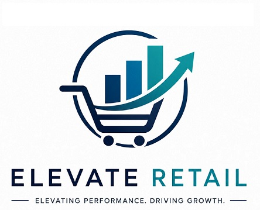
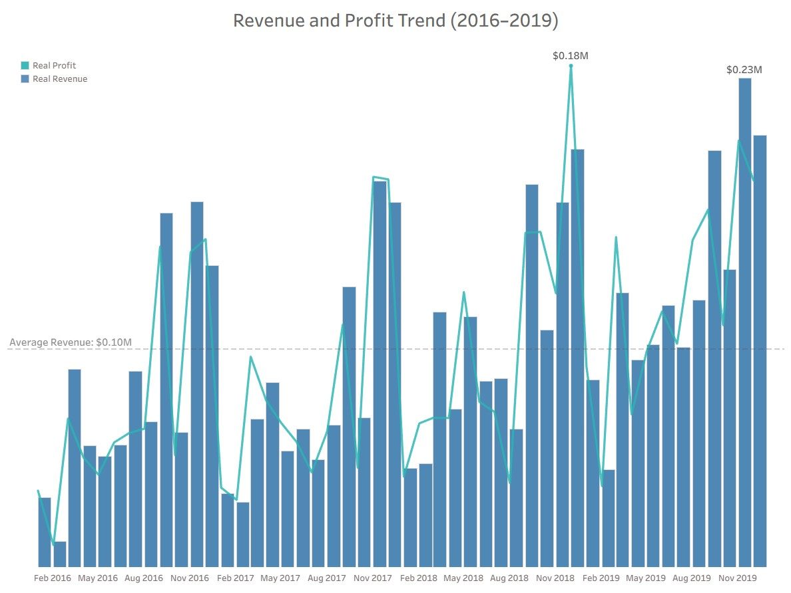

<h1 align="center">Elevate Commerce Sales and Profitability Analysis</h1>
<h2 align="center">Client Background</h2>

Elevate Commerce is a small to mid-sized retail company offering a diverse range of products across categories such as furniture, technology, and office supplies. The company serves multiple customer segments, including Consumer, Corporate, and Home Office.

The analysis is based on a multi-year dataset spanning **2016–2019**, including approximately **5,000** customers and over **10,000** transactions across multiple regions and product categories. The company has demonstrated steady revenue growth over this period, surpassing **$1M** in annual revenue by 2019.

<h2 align="center">Business Objective</h2>

As the business continues to grow, leadership is focused on improving overall performance by better understanding sales trends, pricing strategies, and profitability drivers.

Reporting to the Marketing Director, this analysis evaluates sales performance and identifies key drivers of profitability across product categories and regions. The findings provide actionable insights that cross-functional teams can leverage to streamline processes and enhance overall sales performance. The key insights and recommendations focus on the following areas:

 - **Revenue – Measures overall sales performance across regions and product categories.**
- **Profit – Evaluates the actual financial gain generated from sales.**
- **Profit Margin – Assesses efficiency by comparing profit relative to revenue.**
- **Discount – Analyzes the impact of pricing strategies on profitability.**
- **Product Performance – Evaluates performance at the category and sub-category level to identify high and low performers.**
- **Regional Performance – Compares revenue and profit across regions to identify geographic opportunities and risks.**

 
<h2 align="center">Executive Summary</h2>

<!--   -->

<h2 align="center">Dataset Overview</h2>
The dataset consists of transactional sales data including orders, customers, and product-level details across multiple regions and time periods.

An analysis of Elevate Commerce’s sales data from 2016 to 2019 reveals an overall upward trend in both revenue and profitability, despite a temporary decline in 2017.

Total revenue increased from approximately $528K in 2016 to $799K in 2019, representing significant growth driven by improved sales performance in later years. Similarly, profit rose from $155K to $239K, indicating that the company not only increased sales but also maintained healthy margins.

While 2017 experienced a slight dip in both revenue and profit, performance rebounded strongly in 2018 and continued into 2019, suggesting improvements in sales strategy, product performance, or customer demand.

Further analysis indicates that discounting, product category performance, and customer segmentation play key roles in driving profitability. These findings highlight opportunities to optimize pricing strategies and focus on high-performing segments to sustain long-term growth.

## Objective of the Analysis

This analysis was conducted to evaluate sales performance and identify key factors impacting profitability. The goal is to provide actionable insights into revenue trends, discount strategies, and customer segment behavior to support more informed business decisions and improve overall financial performance.

## Insights
